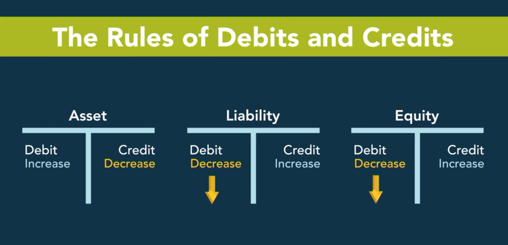

# Financial Accounting - Part 1

## Table of Contents
* [Accounting Equation](#the-accounting-equation)
* [Assets](#assets)
* [Liabilities](#liabilities)
* [Owner's Equity](#owners-equity)
* [Balance Sheet](#balance-sheet)
* [Income Statement](#income-statement)
* [Statement Of Cash Flows](#statement-of-cashflows)
* [How Financial Statements Are Made](#how-financial-made)
* [Debits and Credits](#debits-credits)
* [Accrual Accounting](#accrual-accounting)

<a name="the-accounting-equation"> <h2> The Accounting Equation </h2></a>

1. __Assets__: Economic resources owned or controlled by the company that will provide future benefit to the company. 
   1. Examples:
      1. Cash
      2. Inventory
      3. Buildings
      4. Equipment etc.
2. 2 General Methods to Finance Assets
   1. __Liabilities__: Obligations satisfied through payment or services to someone else. We owe money or services in the future.
   2. __Owner's Equity__: Investments in the company by the owners; in obligation to pay that investments. Or profits left in the company. 
3. Balance Sheet Basics:
   1. Assets = Liabilities + Owner's Equity
   2. Assets (LHS): Economic resources owned or controlled by the business.
   3. Liabilities + Owner's Equity (RHS): Claims against those economic resources or in other words, the __source__ or __origin__ of the assets. 
   4. Accounting equation has to balance to answer the question: "Where did the assets come from?".
4. Statement of Cash Flows Basics:
   1. ``Assets`` from the Balance Sheet Equation contains information about the Assets in the form of Cash. The Statement of Cash Flows is a detailed analysis of cash going into and out of the cash account over a specified period of time. 
   2. Those inflows or outflows are characterized as one of the following:
      1. Operating Activities
      2. Investing Activities
      3. Financing Activities
   3. Sorting of the inflows and outflows by the aforementioned categories will give us the Statement of Cash Flows.
5. Income Statement Basics:
   1. ``Owner's Equity`` from the Balance Sheet Equation comprises of:
      1. Paid In Capital: Amount of money directly invested by the owners of the business in the business. The amount of capital they have paid in.
      2. Retained Earnings: Earnings that have been retained in the business since inception.
         1. Dividends are earnings not retained in the business.
         2. These are subtracted out from the Total Earnings to give us the Retained Earnings.
      3.  Retained Earnings: Revenues - Expenses = Net Income.
          1.  Revenues provide resource inflows. Increases in resources from the sale of goods / services.
              1.  Not the same as cash but the __source__.
          2.  Expenses are resource outflows. They represent cost incurred.
              1.  How assets have been used.
6. All the accounting terms are based on judgements and estimates rather than truths. 
7. Relationship between the 3 Statements

<a name="assets"> <h2> Assets </h2></a>

1. __Pure Definition__: Economic resources owned or controlled by a company that will provide probable future benefit. __Probable__ __future economic benefits__ __obtained or controlled__ by a particular entity as a result of past transactions or events.
   1. __Probable__: Highlights uncertainty i.e. the amount probably be paid.
   2. __Future economic benefits__: Implications only for the future and not the past. 
   3. __Obtained or Controlled__: Underlying __economic substance__ not legal form. 
2. Cash is not the only asset. There are other assets such as:
   1. __Accounts Receivable / Loans Receivable__: The money the business will collect from others in the future based on contracts exist right now. In other words, money owed to the company by its debtors.
   2. __Inventory__
   3. __Land__
   4. __Building__ 
3. Alternative and Simpler definition: Assets are what the company makes use of to provide services and goods to the customers so that their customers will pay them.
4. Assets typically listed on the balance sheet in order of liquidity i.e. how easily they can be turned to cash.
   1. The typical order:
      1. Cash
      2. Supplies and equipment
      3. Intangible Assets
5. Assets are reported in different values i.e. different valuation measures.
   1. Current cost
   2. Realized cost: amount that are supposed to be realized or received.
   3. Historical cost
6. __Time Horizon Classification__
   1. __Current__: One year or less
      1. Cash: Coin, Currencies, Balances in Checking and Saving Accounts. Includes short term money market accounts.
      2. Accounts Receivables: Owed money that are usually collected between 10 - 60 days.
         1. Interest can or cannot be charged
      3. Inventory: Goods held for sale in the normal course of business.
      4. Prepaid Expenses: Payments in advance for business expenses e.g. insurance / rent.
         1. Does provide future economic benefit
      5. Investment Securities: Sold within a year - current assets.
      6. Listed in order of liquidity. 
      7. Current assets are the lifeblood / oil that keeps the business going. Assets are sold and cash is collected and process is repeated. 
   2. __Non-Current__: You expect to still be around over a year to be on the next balance sheet.
      1. Long Term Investments: 
         1. Earn Income
         2. Exercise Influence on the company they are invested in
      2. Property
      3. Plant
      4. Equipment
         1. Depreciation: Depreciation is an accounting method of allocating the cost of a tangible or physical asset over its useful life or life expectancy. Depreciation represents how much of an asset's value has been used up.
      5. Intangibles: Assets with no physical or tangible characteristics such as agreements, contracts, rights or permissions. 
         1. General reporting rule is that the intangible assets that are bought from others and not created by themselves.
         2. Examples:
            1. Patents
            2. Trademarks
            3. Goodwill: Amount paid over and above the value of the assets acquired.
            4. Franchises
         3. All others are reported in the "Other Assets" heading or listed separately.
            1. Examples: Deferred Income Tax Assets and Long Term Receivables.

<a name="liabilities"> <h2> Liabilities </h2></a>

1. __Liabilities__: Obligations requiring future sacrifice either by paying assets or delivering a service.
2. __Payable__: Obligation to pay in the future.
3. Types of Liabilities
   1. Accounts Payable: Credit given to the business. 30 - 60 days.
   2. Wages Payable
   3. Taxes Payable
   4. Interest Payable: Interest on the loans.
   5. Long Term Debt: Money borrowed that has to be paid back in the future.
   6. Unearned Revenue: Obligation by the company to deliver a good or service in the future.
4. Insight in the Accouting Equation involves:
   1. Write down the asset
   2. How you bought the asset
5. __Formal Definition__: Probable future sacrifices of economic benefits arising from present __obligations__ of a particular entity to transfer assets or provide services to other entities in the future as a result of past transactions of events.
   1. __obligations__: Includes legal, moral, social and implied commitments. 
   2. __transfer assets or provide services__
   3. __past transactions or events__: Events that have already happened.
6. Liabilities in simple terms are sources of the funds used to acquire assets.
7. Properly valuing the liability of a company is one of the biggest challenges an account can face.
8. Carefully managed liabilities are the key to a company's success.
9. Time Horizon Classification
   1. Current Liabilities: Expected to be paid within a year.
      1. Accounts Payable is the most common
      2. Taxes
      3. Wages 
      4. Other expenses that remain temporarily unpaid
      5. __Accrued Liabilities__: Expense that is recognized on the books before it has been paid; the expense is recorded in the accounting period in which it is incurred.
      6. Short Term Loans
      7. Portion of Long Term Loans to be repaid within the upcoming year
      8. Unearned Revenue: Obligation to provide an already paid-for service that hasn't been received.
   2. Long Term Liabilities / Non-Current Liabilities: Expected to be paid more than a year.
      1. Long Term Note: Borrowing contract between two parties i.e. company and the bank.
         1. e.g. Bond Issue
      2. Capital Lease Financing is also a liability.
      3. Deferred Income Tax Liability: Income tax expected to be paid in the future years on income that has already been reported in the net income statement but which because of the tax law has not been taxed.
         1. If the value of a taxable investment changes in the future, the business can adjust its deferred tax liability.
      4. Retirement Benefits to Employees
      5. Long term unearned revenue: Those obligations that are to be satisfied periods greater than 1 year aka Deferred Income.
10. Contigent Liabilities: Potential obligations that may occur depending on the outcome of an uncertain future event. 
    1.  Cosigner's obligation on the loan: If borrower defaults on the loan
    2.  Probable, Possible and Remote contigent liability based on the probability but very vauge in practice.
    3.  __Probable__ Contigent Liability should therefore, be reported as a loss on the income statement and liability in the balance sheet.
        1.  For example: Warranty Liabilities
    4. Possible Contingent Liability: Less than probable but not remote.
       1. Disclosed as a note in the financial statements.
    5. Remote Contingent Liability: Not disclosed in the finanical statements based on the guarantee. 
    6. Estimated Liability: Definite obligation with only amount of obligation in question and subject to estimation at balance sheet due date.
       1. Pensions
       2. Warranties
       3. Deferred taxes
   7. Assets and Liabilities are _not_ certain and involve probabilities than in turn are dependent on judgement.
   8. Estimates and Judgements pervade financial statements.

<a name="owners-equity"> <h2> Owner's Equity </h2></a>

1. __Owner's Equity__ aka __Shareholder's Equity__: Money invested by the owners. 
   1. The amount that the owners have invested in a company for the company to buy assets.
   2. Owner's Equity = Paid in Capital + Retained Revenue
      1. __Paid in Capital aka Capital Stock / Contributions__: The amount the owners take out of their personal savings / bank accounts to invest in the business. 
      2. __Retained Revenue__: Business generated revenue / profit.
         1. __Dividends__: Profits distributed to owners of a business.
         2. __Retained Earnings__: Source of owner's equity for profits kept in the business for expansion i.e. reinvested in the business itself.
2. __Equity__: Total Assets - Total Liabilities available after all obligations are satisfied. It is the residual amount post all obligations are paid.
3. __Company ownership__:
   1. Sole proprietorship 
   2. Partnership: Small group.
   3. Corporation: Diverse group of owners.
4. Shares of Stocks are the proof of ownership in the business that can be traded on an exchange.
5. Owner's Equity:
   1. Increases when the contribution of the owners to the business i.e. paid in capital increases.
   2. Increases when the Retained Revenue increases.
   3. Decreases when there are not much profits made causing the Retained Revenue to decrease.
      1. Very poor performance can lead to loss of assets made by the owners.
   4. Paid in Capital is therefore, the portion of owner's equity in exchange for stock shares.
6. Assets - Liabilities = Owner's Equity = Residual Interest of the Owners = Book Value.
7. If balance sheet was perfect, Book Value = Market Value.
8. Gap in Balance Sheet and Market Value (Price * # of Shares Outstanding: Shares outstanding refer to a company's stock currently held by all its shareholders, including share blocks held by institutional investors and restricted shares owned by the company's officers and insiders.)
   1. Many assets are recorded at purchase cost not at current market value.
   2. Not all assets are included in the balance sheets e.g. employees
9. Company's Book Value < Market Value
10. Owner's Equity also includes:
    1.  __Treasury Stock__: A company's repurchase of own shares.
        1.  Shown as a subtraction from total equity as it is cash to the former shareholders who terminate their ownership by selling back their shares.
        2.  Reasons for stock repurchase:
            1.  Show confidence in value of shares: stock is currently undervalued.
            2.  Way to distribute unneeded excess cash.
        3.  __Accumulated other comprehensive income__: The compromise that allows market values in the balance sheet while keeping the income statement uncluttered.
            1.  Market related gains and losses not included in the income statements
            2.  Examples:
                1.  Equity of foreign subsidiaries 
                2.  Value of Investment Securities
                3.  Value of Derivatives

<a name="balance-sheet"> <h2> Balance Sheet </h2></a>

1. __Accounting Cycle__: Process of analyzing business events and collecting, processing, and summarizing information in a report.
   1. Have computers made accounting cycle obsolete?
      1. Analysis of complex and unusual transaction still requires accounting judgement.
      2. Computers have enhanced our ability to munge a lot of data.
2. Balance Sheet + Income Statement + Statement of Cash Flows allows readers to make decisions regarding the companies past and future.
3. __Financial Statement Notes__
   1. Summary of Accounting Policies
   2. Additional Information about Summary Totals 
   3. Disclosure of Important Information
   4. Supplementary Information required by SEC or FASB 
4. Important to know what procedures were used for the preparation of the financial statements.
5. Recognition: Including estimates and judgements in the financial statements described in a note.
6. Financial Statement Notes also provide:
   1. Explainations of assumptions
   2. Provide details of summary numbers
   3. Provide other misc information
7. __Limitations of Balance Sheets__
   1. Balance sheet doesn't reflect Market Value.
   2. Current Value not reflected
      1. Assets reported at historical cost
      2. Other assets not included
      3. Intangible assets not recognized
   3. Average Equity Market Value is 30% larger than the Average Equity Value for the DOW
   4. Instability of the Dollar is another Balance Sheet limitations i.e. inflationary risk
      1. Different currencies introduce their own nuances.
   5. All companies don't classify and report items similarly
   6. Some entity resources and obligations are not reported at all
      1. Brand Value

<a name="income-statement"> <h2> Income Statement </h2></a>
1. Income Statement effectively tells us how much you made based on a __period__ of time vs. a Balance Sheet that's a __snapshot__ or __point in time__.
2. Large corporations are expected to report income quarterly and annually.
3. Income statement reports the Net Income = Revenues - Expenses in the end.
   1. Revenues generated and costs incurred to generate that revenue mentioned in the income statement.
4. Components of __Net Income__:
   1. __Revenue__: Amount of assets created through the sale of goods and services.
      1. In the form of cash and accounts receivable.
      2. Increase in total assets and equity.
   2. __Expenses__: Costs incurred in normal business operations to generate revenues.
      1. Decrease in total assets and equity.
   3. __Net Income__: A proxy of companies overall performance. Sometimes called Earnings or profits. Revenues - Expenses = Net Income.
      1. If Revenue > Expenses: Net Profit
         1. Increases Equity.
      2. If Revenue < Expenses: Net Loss
         1. Decreases Equity.
   4. Revenues are Total resource (Gross) increases while Assets are a result of Expenses subtracted from Revenues (Net).
5. Activities resulting from Revenues generate Assets. However, Assets can be as a result of many different activities such as borrowing money.
6. __Components of the Income Statement__ 
   1. Sales - Cost of Sales (Cost of Goods Sold) = Gross Profit (Gross Margin)
   2. Gross Profit / Sales x 100 % = Gross Profit Percentage.
   3. Gross Profit - Operating Expenses = Operating Income (Earnings before Interest and Taxes)
      1. How well a business is performing at its unique activities.
   4. Operating Income - Other Revenues, gains, expenses, losses = Income before taxes
   5. Net Income: Summarizes a company's overall economic performance for a given period.
   6. Income Before Income Taxes: Includes the income earned that doesn't have taxes subtracted out.
7. __Revenues vs. Gains__
   1. Revenues: Increase in assets from normal business activities.
   2. Gains: Increases in assets from peripheral activities or not central to the business.
8. __Expenses vs. Losses__
   1. Expenses: Decrease in assets from normal business activities.
   2. Losses: Decrease in assets from peripheral activities or not central to the business.
9. Restructuring Charges: Not recurring items. 
10. __Earnings per Share__
    1.  Amount of Income associated with each common share of stock.
    2.  2 numbers disclosed
        1.  Basic EPS: Income available to common shareholders.
            1.  (Net Income - Dividends) / Average number of common shares
            2.  It shows investors the percentage return they can expect on their investment.
        2.  Diluted EPS: Existence of Stock Options or other rights that can be converted into these shares.
            1.  Potential impact on EPS on the exercise of existing options or other rights to shares. 
    3.  EPS is used to compute the PE ratio
        1.  Is a multiple of earnings.
        2.  PE Ratio: Market Price / Annual Basic EPS
            1.  High PE Ratio: Overvalued stock is expected to earn more or a strong growth in the future than what it currently does.

<a name="statement-of-cashflows"> <h2> Statement of Cashflows </h2></a>
1. Statement of Cashflows has 3 sections:
   1. Operating Activities 
      1. Most important! 
      2. Company's daily operations are making cash or losing cash.
      3. Everyday business.
   2. Investing Activities
      1. Investments in the productive capacity of the business.
      2. On occasion.
      3. Ex. Buying land, buildings.
   3. Financing Activities
      1. Financing to buy the assets the business needs. 
      2. Dealing with banks and shareholders.
2. Important to compare the cash generated from operating activities and the cash needed for investing activities.
3. Cash Cows: A company that generates so much cash from operating activities that it can fund its investing activities by itself.
4. Cash in - Cash out separated into the 3 aforementioned activities.
   1. Financing to buy the assets
   2. Investing to conduct operations
   3. Operating to do business
5. Why the cash flow increases / decreased is a better question answered.
6. Flavors of Cash Flows
   1. Start up
      1. Negative Operating Cash flows
      2. Massive Operations of Capital Assets 
      3. Financed through selling stock and issuing debt.
   2. Mature
      1. Positive cash from operations
      2. Investments in long term assets
      3. High financing cash flows
   3. Cash Cow
      1. Enough cash generated from operations to finance all investing activities as well as utilizing the excess assets for activities. 
      2. For a safe company, you'd want the company to invest mainly in the operating cash flow section.

<a name="how-financial-made"> <h2> How Financial Statements Are Made </h2></a>
1. Booking Keeping is extremely important in modern society to extract and audit transactions.
2. Booking Keeping is the perseveration of a systematic quantitative record for an activity. And until you have a record of an activity, you can't make any sophisticated decisions.
3. __Transaction Analysis__: Process of determining how an economic event impacts financial statements.
4. Prepaid items are assets as they provide benefit now. 
5. Revenue is recorded at the time of the sale / service provided. There is no change made to Revenue when payment is received.
6. Expanded Accounting Equation: Assets = Liabilities + Paid in Capital + ( Revenues - Expenses - Dividends )
7. Performance is evaluated via the statements and used to make business decisions.

<a name="debits-credits"> <h2> Debits and Credits </h2></a>
1. __Journal__: Chronological listing of business events using accounting debit-credit language.
2. __Ledger__: Copy of journals events sorted by category or account.
3. __Posting__: Conversion of the business events from the journal to the ledger.
4. __Journal Entries__: Summarize accounts involved in a transaction - increase, decrease, and associate amounts.
5. Power of debit and credit systems make mistakes low.
6. Row and column analysis based on the accounting equation can be cumbersome.
7. Simpler framework: Debits and Credits.
8. ``Debits = Credits`` is the main rule ensuring the accounting equation is always in balance.
9. Increases are represented by writing the corresponding values on one side of the page. Decreases are represented by writing it on the other side.
   1. Debit is used for the left side and Credit used on the right side.
10. Rules of Debits and Credits
   1.  Increases in assets are written on the left side of the page.
       1.  Assets go up on the left, Assets go down on the right.
   2.  Liabilities and Equities are exactly the opposite i.e. the right side of the page.
       1.  Liabilities and Equities go up on the right and down on the left.
   3.  Example 1: $100 received by paid in capital.
       1.  Debit $100 in the Assets account.
       2.  Credit $100 in the Paid in Capital / Equity account.
   4.  Example 2: $200 paid out in expenses.
       1.  Credit $200 in the Assets account.
       2.  Debit $200 in the Expenses / Equity account.
   5.  Example 3: $300 loaned from the bank.
       1.  Debit $300 in the Assets account.
       2.  Credit $300 in the Liabilities account under Loan Payable.
11. Preparation of Journal Entries involve 3 main steps:
    1.  Identify the accounts.
    2.  Find out if the accounts increased / decreased.
    3.  Compute how much did the accounts change.
12. Traditionally, account with a debit is listed first and then the credit.
    1.  Credit entry is indented.
13. Don't net the cost of goods sold and revenue. Keep the breakup of the Retained Revenue separate.
14. Paying off a liability doesn't create an expense.
    1.  Expenses are created when businesses cause assets to be consumed or liabilities are created such as unpaid wages.
15. Dividends aren't reported as expenses on the income statement.
16. Posting involves sorting the debits and credits from all journal entries and copying them to __individual accounts__ for each item. 
    1.  For example, for cash, all the journal entries are accumulated and presented like a single page of a paper with debits to the left and credits to the right and usually a single balance.
17. The T Account is this visual representation of individual accounts with debits to the left and credits to the right.
18. Ledger is a collection of the posted accounts.
19. Posting requires no analysis.
20. Once all the accounts are posted, balances for each account are computed. 
21. The overall balances between the debits and credits should be equal.
22. __Trial Balance__: Internal Document used to summarize account balances for all accounts from the companies accounting system produced via the Ledger.
23. Trial Balance != Balance Sheet
24. Balance Sheet is a one-page summary document based on the the trial balance.
25. The Trial Balance is the raw material used to create the Balance Sheet and the Income Statement.

<a name="accrual-accounting"> <h2> Accrual Accounting </h2></a>

1. Accrual Accounting is still the undisputed champion of performance measures. 
   1. It was found that the adjusted-R2 statistic of accrual accounting net income was significantly higher than the raw cash flows from operations with respect to the annual change in market value of a company.
2. Net Income != Cash Flow.
3. __Accrual Accounting__: Accounting method that records revenues and expenses when they are incurred, regardless of when cash is exchanged. The term "accrual" refers to any individual entry recording revenue or expense in the absence of a cash transaction.
4. Accountants must make estimates and assumptions in order to convert the raw cash flow data into a more meaningful measure of performance, net income. This process, accrual accounting.
5. At the end of each accounting period, in order to report all asset, liability and owner's equity amounts properly, and to recognize all revenues and expenses for the period on an accrual basis, accountants are required to make any necessary adjustments prior to preparing the financial statements.
6. Items Requiring Analysis for Adjustments
   1. Unrecorded Receivables
      1. Revenues should be recorded when earned regardless of when the cash is received.
      2. These fall under the unrecorded receivables item => assets.
      3. For example, services whose invoice isn't made but the services are conducted.
   2. Unrecorded Liabilities
      1. Expenses incurred prior to being paid. 
      2. For example, employees work at the end of the year but their paycheck is paid next year. 
   3. Prepaid Expenses
      1. Payments a company makes in advance for items normally charged to expense. 
      2. Show partial consumption of an asset.
      2. For example, payment of insurance premium for the next few months.
      4. For example, rent paid for the next 2 years. 
   4. Unearned Revenue 
      1. Amounts received before the actual earning of revenues.
      2. Liabilities since the service still needs to be rendered.
      3. For example, paying for airline tickets in advantage but obligation to provide the ride is required.
7. __Adjusting Entries__ are journal entries required at the end of each accounting period to recognize on an accrual basis, revenues and expenses for the period, and to report proper amounts for asset, liability, and owners' equity accounts. 
8. Adjusting Entries are analysis of circumstances at each period's close. 
   1. Determine if the amounts of all assets and liabilities are correct i.e. make sure that there is accuracy of amounts of the assets and liabilities i.e. fix the balance sheets.
   2. Revenue or expense adjustments are required i.e. fix the income statement.
9. It's good practice to check at the end of the accounting year, if any revenue isn't accounted for.
10. After the statements have been created for one year, through a process involving closing entries, the income statement numbers are set at zero and the balances in those accounts are transferred to their permanent home, the retained earnings account.
    1. Closing Revenue Accounts: debit Sales Revenue and credit Retained Earnings.
    2. Closing Expense Accounts: debit Retained Earnings and credit COGS.
    3. Closing Dividend Accounts: debit Retained Earnings and credit Dividends.
11. Once all regular journal entries and adjusting journal entries are posted to individual accounts, a balance for each account can then be computed.
12. Trial Balance Sheet organized in:
    1.  Assets
    2.  Liabilities
    3.  Equities
    4.  Dividends
    5.  Revenues
    6.  Expenses
13. Easier to start with the income statement.
14. Cash -> Balance Sheet.. Nothing appears both in the Balance Sheet __and__ Income Statement.
15. Ending Retained Earnings = Beginning Retained Earnings + Net Income - Dividends.
16. From this ending retained earnings, we then make the Balance Sheet.
17. Cycle:
    1.  Transactions recorded in the Journal as Journal Entries
    2.  These Journal Entries are sorted and categorized in the Ledger as a collection of T-Accounts in the posting process.
    3.  End of year adjustments made.
    4.  The data is then used to make the financial statements. 